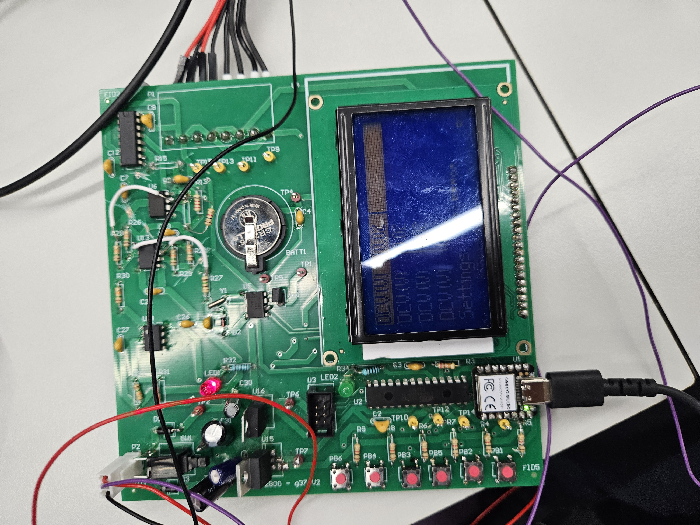

# Power Meter

This repository is a  mirror of a team project developed for **ENGG2800**. 

A high precision digital power meter designed to sample voltage and current telemetry from a load, calculate real time electrical parameters, and stream data to a localised GUI for monitoring and analysis. The system bridges custom hardware instrumentation with embedded processing and local host application interfaces.

### Finished Prototype


### Hardware Documentation
* [PCB Schematic and Layout (PDF)](assets/PCB_Artwork.pdf)

## The Engineering Team & Contributions

This project was developed by a collaborative 4 person engineering team. Individual technical ownership is broken down below:

* **Joseph Lee (Firmware & Analogue Electronics Engineer):** Engineered the core measurement firmware, designed and implemented the signal conditioning analogue circuits, and performed the final hardware schematic and PCB design audits to ensure production compliance. Compiled and structured the final engineering Bill of Materials.
* **Software Engineer:** Developed the desktop Graphical User Interface (GUI), built the data parsing serial communication protocols, and integrated secondary hardware timekeeping features.
* **Display Systems Engineer:** Owned the low level firmware drivers and hardware interfacing for the localised system LCD menus.
* **PCB Design Engineer:** Handled the physical PCB layout routing, electronic component soldering, and implemented safe switching circuitry for wide-range current measurements.

## My Contributions

### 1. Analogue Measurement Circuit Design
* **Signal Conditioning:** Designed and implemented a five stage pipeline matching analogue to digital converter constraints to safely process AC and DC voltage and current waveforms.
* **Iterative Prototyping:** Conducted rigorous breadboard testing and design iterations to select optimal scaling and biasing topologies (See the beautiful chaos below).


* **Hardware Debugging:** Resolved circuit loading effects by introducing active operational amplifier buffering stages.
* **Power Subsystem Redesign:** Eliminated amplifier saturation by upgrading supply rails to 10V and integrating a 5V regulator for the ATmega microcontroller and display.
* **Simulation:** Modelled all AC and DC measurement circuits using simulation software to validate operational theory prior to production.

### 2. Measurement Firmware Engineering
* **Architecture:** Developed an interrupt based sampling architecture to ensure deterministic data collection and system responsiveness.
* **Signal Processing:** Implemented low level firmware executing real time calculations, transitioning raw data into True Root Mean Square accumulation loops.
* **Precision Metrics:** Engineered efficient firmware routines to calculate frequency, power factor, and phase angles.
* **Data Streaming:** Designed serial communication protocols to stream calculated telemetry data to the host interface.

### 3. PCB Review and Documentation
* **Design Audits:** Spearheaded comprehensive hardware schematic reviews against technical standards to prevent layout errors.
* **BOM Generation:** Compiled the final engineering Bill of Materials, cross referencing datasheets to guarantee exact footprint matches and proper component sourcing.

#### Bill of Materials (BOM)
* [BOM](assets/BOM.pdf)

## Repository Architecture

The codebase has been stripped of legacy test files and is organised strictly around the deliverables:
```text
Power-Meter/
├── .gitignore
├── embedded/           # Firmwire Files
│   ├── lcd/            # Display drivers
│   └── measurement.X/  # Core firmware workspace
└── lab_pc/             # GUI Files
│    └── GUI_new.py      # Python based user interface for telemetry rendering
│
├── PCB/                # Altium Designer Project